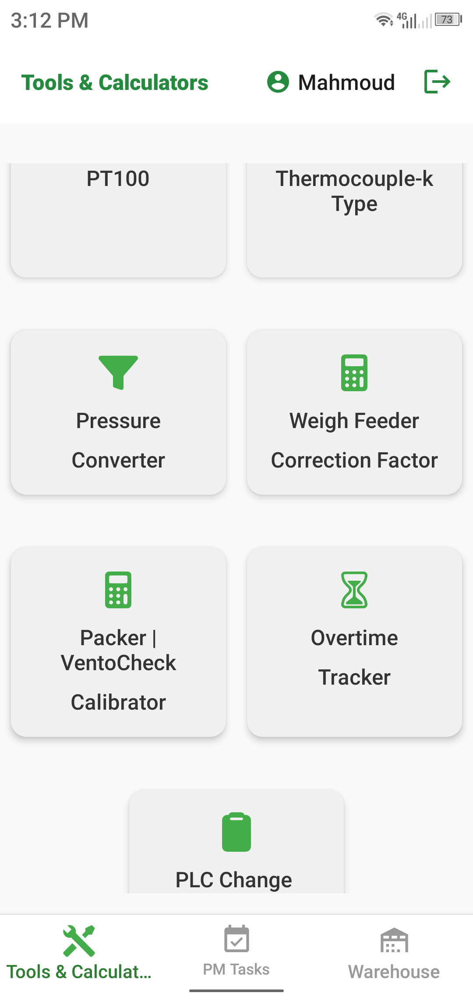
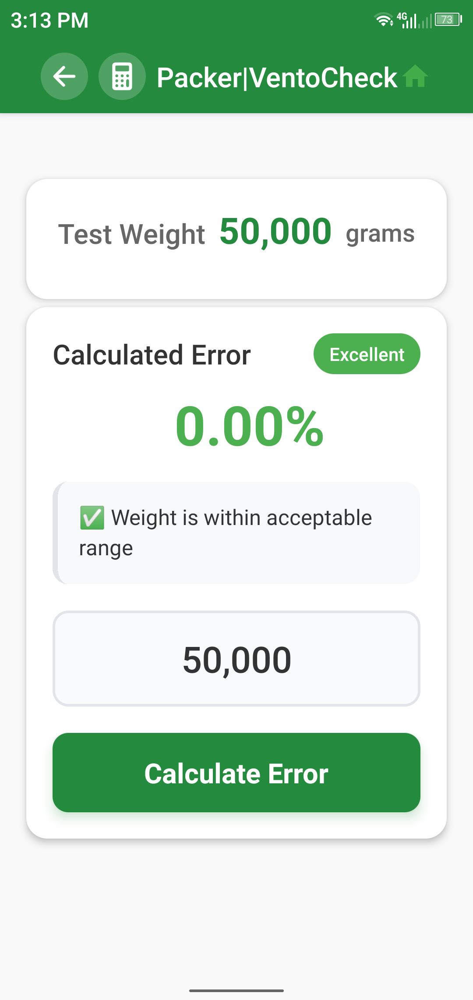

# Instrumobile App

Instrumobile is a comprehensive mobile application for industrial maintenance teams, designed to manage PLC modifications, spares, preventive maintenance, overtime, and more. Built with React Native, Expo, and Firebase, it provides a modern, cross-platform experience for plant engineers and technicians.

---

## 🚀 Features

- **PLC Modification Management:** Add, edit, and cancel PLC modification requests. Track status and history.
- **Spares & Tools Tracking:** View, search, and manage spares and tools inventory.
- **Preventive Maintenance:** Log and review maintenance activities.
- **Overtime Management:** Record and review overtime requests and approvals.
- **User Authentication:** Secure login with Firebase Auth.
- **Cloud Firestore Integration:** Real-time data sync and offline support.
- **Modern UI:** Clean, responsive design using Expo and React Native components.

---


## 📱 Screenshots

<div align="center">

### 🔧 Main Features
<table>
  <tr>
    <td align="center">
      
      <br /><b>PLC Modifications</b>
      <br /><sub>Manage PLC changes & requests</sub>
    </td>
    <td align="center">
      
      <br /><b>Spares Inventory</b>
      <br /><sub>View & search spare parts</sub>
    </td>
    <td align="center">
      
      <br /><b>Warehouse Search</b>
      <br /><sub>Advanced search & filtering</sub>
    </td>
  </tr>
</table>

### 📊 Task Management
<table>
  <tr>
    <td align="center">
      
      <br /><b>PM Tasks</b>
      <br /><sub>Preventive maintenance tracking</sub>
    </td>
    <td align="center">
      
      <br /><b>Task Details</b>
      <br /><sub>Detailed task information</sub>
    </td>
    <td align="center">
      
      <br /><b>Overtime Tracker</b>
      <br /><sub>Time management & reports</sub>
    </td>
  </tr>
</table>

### 🧮 Engineering Tools
<table>
  <tr>
    <td align="center">
      
      <br /><b>Tools Dashboard</b>
      <br /><sub>Engineering calculation tools</sub>
    </td>
    <td align="center">
      
      <br /><b>Pressure Converter</b>
      <br /><sub>Unit conversion tool</sub>
    </td>
    <td align="center">
      
      <br /><b>PT100 Calculator</b>
      <br /><sub>Temperature sensor calculations</sub>
    </td>
  </tr>
  <tr>
    <td align="center">
      
      <br /><b>Thermocouple Tool</b>
      <br /><sub>Temperature measurement helper</sub>
    </td>
    <td align="center">
      
      <br /><b>Weigh Feeder Calibration</b>
      <br /><sub>Equipment calibration tool</sub>
    </td>
    <td align="center">
      
      <br /><b>VentoCheck</b>
      <br /><sub>Ventilation monitoring</sub>
    </td>
  </tr>
</table>

</div>

---

## 🛠️ Technologies Used

- [React Native](https://reactnative.dev/)
- [Expo](https://expo.dev/)
- [Firebase (Firestore & Auth)](https://firebase.google.com/)
- [Redux Toolkit](https://redux-toolkit.js.org/) (for state management)
- [@expo/vector-icons](https://docs.expo.dev/guides/icons/)

---

## ⚡ Getting Started

### Prerequisites
- Node.js >= 16.x
- npm or yarn
- Expo CLI (`npm install -g expo-cli`)
- A Firebase project (for Firestore and Auth)

### Installation
1. **Clone the repository:**
    ```bash
    git clone <your-repo-url>
    cd instrumobileapp
    ```
2. **Install dependencies:**
    ```bash
    npm install
    # or
    yarn install
    ```
3. **Configure Firebase:**
    - Copy your Firebase config to `firebase/firebaseConfig.js`.
    - Set up Firestore security rules (see below).
4. **Start the development server:**
    ```bash
    npx expo start
    ```

---

## 🗂️ Project Structure

- `components/` — Reusable UI components (lists, headers, etc.)
- `screens/` — Main app screens (PLCs, Spares, Maintenance, etc.)
- `constants/` — Color palette and other constants
- `firebase/` — Firebase config and helper functions
- `store/` — Redux store and slices for state management
- `assets/` — App icons, images, and static files

---

## ⚙️ Configuration

- **Firebase:**
   - Update your Firebase credentials in `firebase/firebaseConfig.js`.
   - Enable Firestore and Authentication in your Firebase project.
- **Expo:**
   - Make sure to install the Expo Go app on your device for easy testing.
- **Security Rules:**
   - Set up Firestore security rules to control access (see example in `/firebase/firebaseConfig.js` or your Firebase Console).

---

## 🧑‍💻 Usage

1. **Login/Register:** Sign in with your credentials (Firebase Auth).
2. **Navigate:** Use the bottom tab or drawer navigation to access PLC Modifications, Spares, Maintenance, and more.
3. **Add/Edit:** Tap the plus or pencil icons to add or edit records.
4. **Search/Filter:** Use search bars and filters to quickly find items.
5. **Sync:** All changes are synced in real-time with Firestore.

---

## 🛡️ Troubleshooting

- **App won't start?**
   - Make sure all dependencies are installed and your Firebase config is correct.
- **Permission errors?**
   - Check your Firestore security rules and ensure your user has the right permissions.
- **UI issues?**
   - Run `expo start -c` to clear cache.
- **Android/iOS build issues?**
   - Make sure you have the latest Expo CLI and SDK versions.

---

## 🤝 Contributing

Contributions are welcome! To contribute:
1. Fork the repository
2. Create a new branch (`git checkout -b feature/your-feature`)
3. Commit your changes
4. Push to your fork and submit a pull request

---

## 🙏 Credits

- Developed by Mahmoud Dayem .
- Thanks to the open-source community for libraries and inspiration

---

## 🌐 Connect

For more information, connect with me on [LinkedIn](https://linkedin.com/in/mahmoud-abdeldayem-abdelhaleem).

---

## Build Commands Reference

This section provides a comprehensive guide for building, testing, and deploying the Instrumentation Mobile App using Expo Application Services (EAS).

### 🚀 Quick Start Commands

```bash
# For testing (APK generation)
eas build -p android --profile preview

# For production (AAB generation)
eas build --platform android --clear-cache

# For development
npx expo start --clear
```

### 📱 Android Builds

#### Testing Build (APK)
```bash
# Generate APK file for testing on devices
eas build -p android --profile preview
```
- **Use Case**: Internal testing, QA, beta testing
- **Output**: APK file (smaller, easier to distribute)
- **Installation**: Direct APK installation on Android devices

#### Production Build (AAB)
```bash
# Generate Android App Bundle for Play Store
eas build --platform android --clear-cache
```
- **Use Case**: Google Play Store submission
- **Output**: AAB file (optimized for Play Store)
- **Benefits**: Smaller download size, dynamic delivery

#### Development Build with Cache Clear
```bash
# Clear cache and rebuild (troubleshooting)
eas build -p android --clear-cache
```

### 🍎 iOS Builds

```bash
# iOS build with cache clearing
eas build --platform ios --clear-cache
```
- **Requirements**: Apple Developer account
- **Output**: IPA file for App Store or TestFlight

### 🔧 Development Commands

#### Start Development Server
```bash
# Standard development server
npx expo start

# With cache clearing (recommended for troubleshooting)
npx expo start --clear
```

#### Run on Devices/Simulators
```bash
# Android device/emulator
npx expo run:android

# iOS simulator (macOS only)
npx expo run:ios
```

### 🛠️ Troubleshooting

#### Complete Dependency Reset
When facing package conflicts or mysterious errors:

```bash
# Step 1: Clean slate
rm -rf node_modules package-lock.json

# Step 2: Fresh installation
npm install

# Step 3: Install critical packages
npm install expo-asset expo-constants @expo/vector-icons

# Step 4: Start with cleared cache
npx expo start --clear
```

#### Environment Secrets Management
```bash
# Push secrets to EAS
eas secret:push

# List current secrets
eas secret:list --profile preview
```

### 📋 Build Profiles

The app uses different build profiles for different purposes:

- **`preview`**: Testing builds (APK generation)
- **`production`**: Store-ready builds (AAB/IPA generation)
- **`development`**: Development builds with debugging enabled

### 🔍 Common Issues & Solutions

| Issue | Solution |
|-------|----------|
| Metro bundler cache issues | `npx expo start --clear` |
| Package version conflicts | Delete `node_modules` → `npm install` |
| Missing environment variables | `eas secret:push` |
| Build fails with cache errors | Add `--clear-cache` flag |
| Android build not installing | Use preview profile for APK |

### 📦 Critical Dependencies

Make sure these packages are always installed:

```bash
npm install expo-asset          # Asset management
npm install expo-constants      # App configuration
npm install @expo/vector-icons  # Icon library
```

### 🏗️ Build Process Flow

1. **Development** → `npx expo start --clear`
2. **Testing** → `eas build -p android --profile preview`
3. **Production** → `eas build --platform android --clear-cache`
4. **Deployment** → Upload to respective app stores

For detailed build configurations, check the `eas.json` file in the project root.

---


